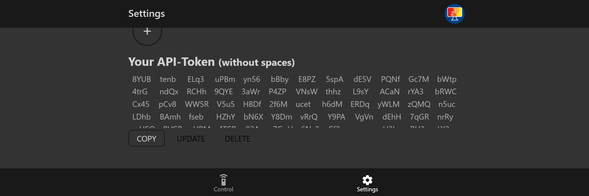
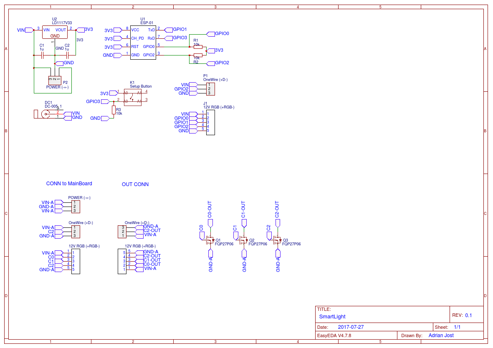

# IFTTT & Google Assistant


You need an [IFTTT Account](https://ifttt.com/discover) to continue.


### 0. Open IFTTT and create a new action

Open: [https://ifttt.com/create](https://ifttt.com/create)

### 1. Create Action Trigger

1. Choose "Google Assistant" as the Service
2. Choose "Say a phrase with a text ingredient"
3. Enter some phrases with a $ placeholders like: "_Turn the light $_" \(figure 1\) and choose your language.
4. Click "Create Trigger"

### 2. Create Action

1. Choose "Webhooks" \(figure 2\) as your action service.
2. Fill in the webhook form
   1. URL: `http://localhost:5000/aj-smartlight/us-central1/api/units/setNL`
   2. Method: `POST`
   3. Content Type: `application/JSON`
   4. Body
      1. Open the Web-App, go to settings and create your personal access token. \(figure 3\)
      2. Body Content:  `{    "userid": "YOUR USERID",    "token": "YOUR ACCESS TOKEN",    "lang": "de",   "payload": "{{TextField}}"  }`
3. Click "Create Action"

### 3. Test it - "Hey Google, turn on the kitchen light"

That's it. Now enjoy using your voice to control your home.  
The API understands a lot of colors and all the named gradients you have saved. If you discover that the Assistant doesn't understand some words correctly, you can give your lamps and groups "tags" which will be handled like aliases.

