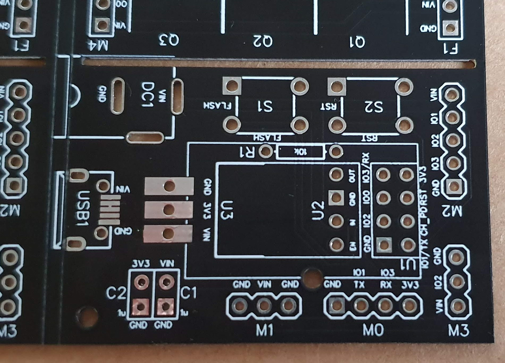
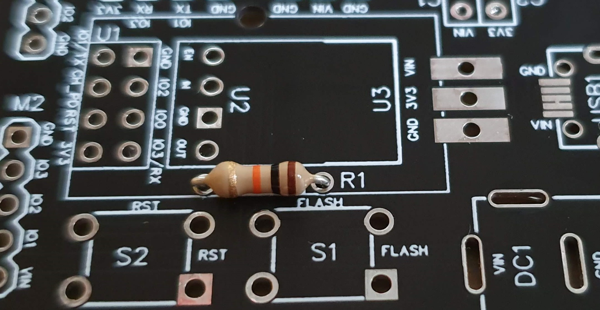
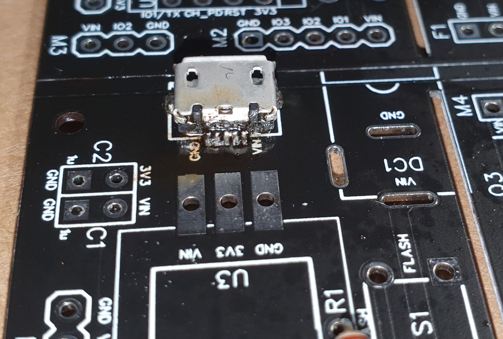
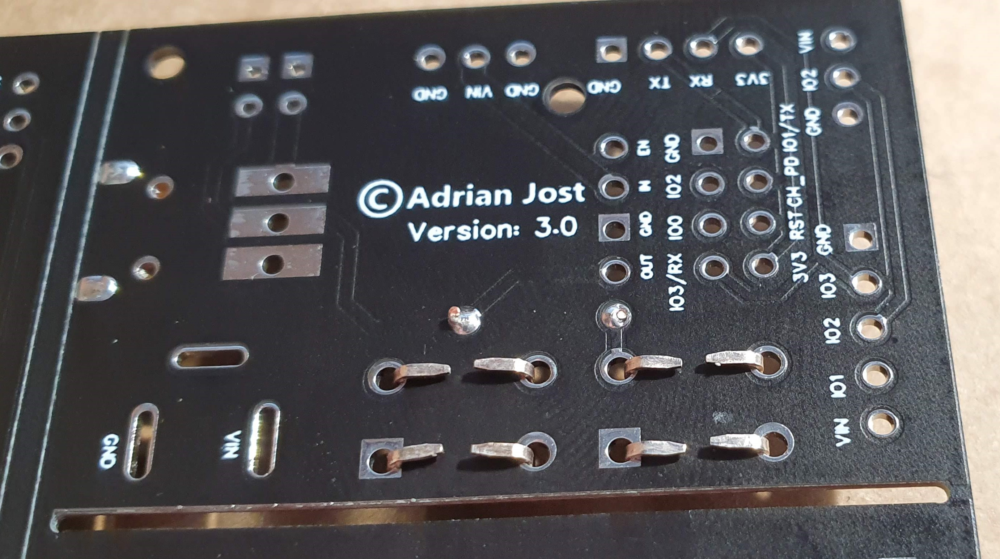
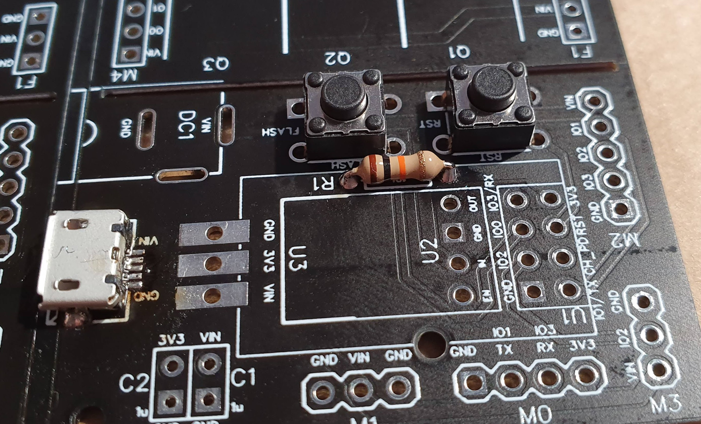
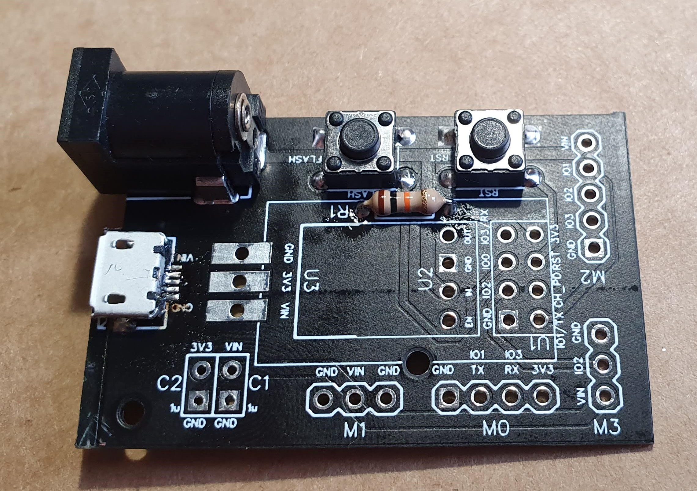
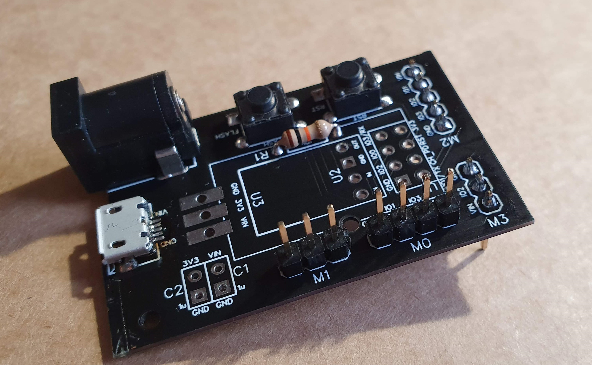
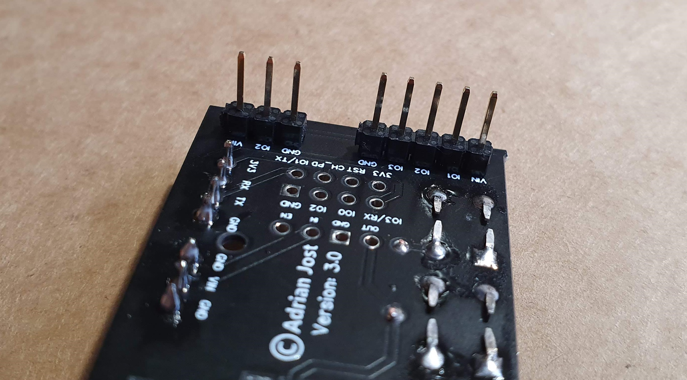
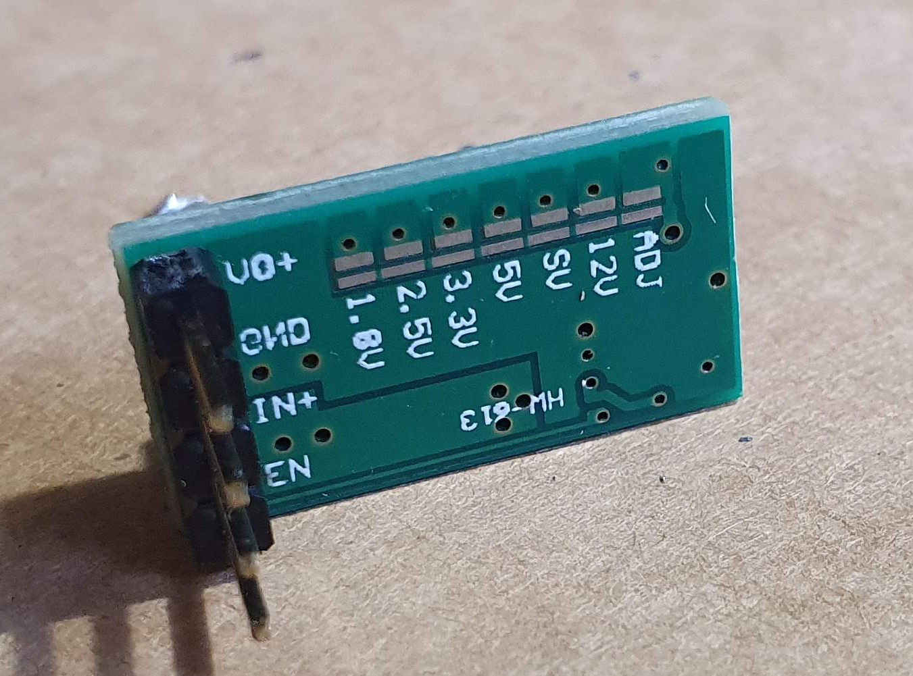
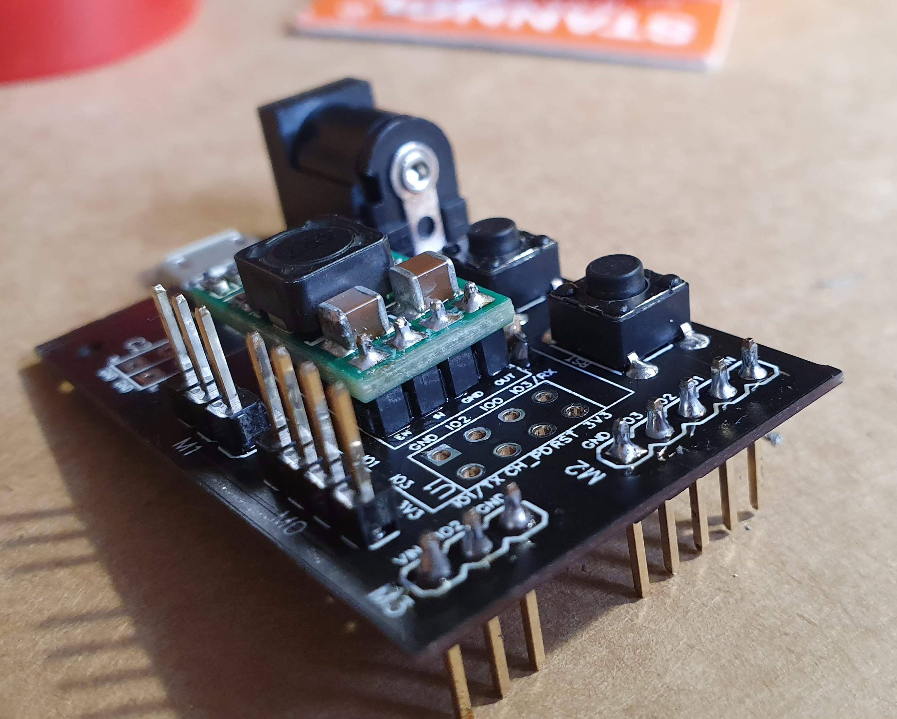

# Assemble the PCB\(s\)

## Main/Base PCB


It is highly recommended to start with the flat components and do the tall components at last.



The order presendet here is just the order I assembled the PCB. It is not required to follow this guide strictly and you can skip and reorder all the steps as much as you like. 😉


### 1. get the main PCB

### 2. R1: 10k Ohm resistor

### 3. USB1: Micro USB

This is most likely the trickiest part. My way is, to add some solder to the left mounting point and move the port into position while heating up this point. I then secure the other side with more solder and connect the pins at last. When soldering the data pins I add some solder to them and then move the solder iron from the port away until there are no short circuits. \(Except the one between the two connections next to VIN, those are required by some cheap power supplies to detect that a device is plugged in.\)

### 4. S1, S2: Push Buttons

I recommend folding the legs before soldering them. This makes soldering way easier.

### 5. DC1: Barrel Plug

### 6. M0-M3: Pin Headers

M0 is for programming the ESP, M1 is for stability when connecting adapter PCBs and therefore optional.


I accidently soldered M1 oriented to the top. Do not do this! M1 belongs to the other \(bottom\) side of the PCB.



 accidently soldered M3 oriented to the bottom. Do not do this! M3 belongs to the other \(top\) side of the PCB.


### 7. U2-U3: Power Converter

#### 7.1 U2: Boost Converter

Step one is, to connect the 3V3 jumper on the backside and verify that the converter outputs 3V3,´. If it is not, you may need t adjust the potentiometer on the front side using a screwdriver. I also got my converter with some pin headers attached which made the soldering very easy. But this step is not required and you can also lay the converter onto the PCB and add a lot of solder to it. This step may require some creativity.

#### 7.2 U3: LD1117V33


WIP, this section is not tested and without images. Use your brain and tinker around. Feel free to contribute to this page.


* [ ] LD1117V33
* [ ] 10nF capacitor to C1
* [ ] 100uf capacitor to C2

### 8. U1: ESP8266-01

I am using 2x \(1x4\) pin headers. To solder them more easaly I plugged in an dead ESP to hold them together. But be carefull and fast! To much heat may damage something.

### You did it 🥳

