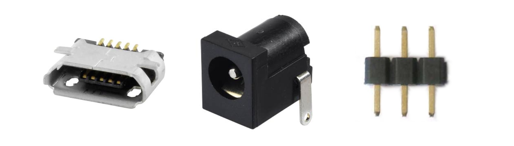
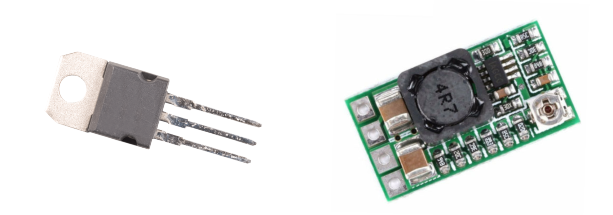

# Get required components

Depending on the devices you want to controle you may can skip several of these components. The circuit board is designed to support several variations and use cases. It is therefore recommended to read the full build tutorial before ordering any components.

## Get the PCB\(s\) 

I have ordered my PCBs from [JLCPCB](https://jlcpcb.com/). The quality is great there and the price is incredibly good, especially for low quantities. Simply upload the gerber files from the hardware repository and order your PCBs.

I orderd black PCBs with a thickness of 0.8mm. I wouldn't recommend thinner PCBs but everything else is up to you.

## Get the Components

You obviosly need some components to solder on the PCB.

### Main/Base PCB

#### ESP8266-01

Obviosly you need a ESP8266-01. It will be the brain of the project. If you can try to get one with a black PCB. These will have 1MB of Flash. The blue ones often only have 512K and doesn't cost less.

You also need 2 Push Buttons to flash, reboot and setup the ESP.

1x 10k Ohm resistor

#### Power

To Power the project you can use Micro USB, a 2.1mm Barrel Plug or a simple 2.54mm Pin Header. 

In addition you need some voltage converter to create 3V3 for the ESP. You can either use one of these efficient boost converters or you can use a TO-220 based voltage converter like the LD1117V33. I prefer the boost converter, just because it is more efficient, but I haven't had any problems using the LD1117V33 so it's up to you.

If you decide to use the LD1117V33 you will also need two capacitors \(1x 100nF and 1x 10uF\)

#### Pin Header

In addition you will need a lot of male and female pin headers. 

* 2x4 or 2x \(1x4\) female pin headers for mounting the ESP8266-01
* 1x4 pin header for programming the ESP

Depending in the LEDs you want to connect you need:

* 1x3 male pin header to connect WS2812B NeoPixel LED Stripes
* 1x5 male pin header to connect to the MOSFET Adapter PCB
  * + 1x3 male pin header just for stability

### MOSFET Adapter PCB


Do not add the R5 Resistor. If connected the ESP won't boot when this PCB is connected. Check [Issue 2](https://github.com/adrianjost/SmartLight-Hardware/issues/2).


If you want to controle 12V/24V based LED Stripes you can not connect them directly to the ESP. You need to boost the output signal in order to light them up. For this reason, there exists the MOSFET Adapter PCB. Depending on the number of Channels you wan't to connect you need 1 to 3 MOSFETs. In addition you need _\(optional: 3 Pull Down Resitors and\)_ 3 current limiting Resitors. I can't tell you the exact values you need, because they depend on the MOSFETs you can get. The most important thing is, that the MOSFET can be fully opened by 3V3.   
I am using the IRLB8721PBF TO-220AB 65W MOSFETs and 470 Ohm current limiting resistors. 


Before buying the resitors, please check that they actually fit onto the PCB.


In addition you need a 1x5 and a 1x3 female counterpart to the male headers from the main PCB and a 1x5 male/female header to connect to the LED Stripes.

### Custom Dev Adapter PCB

This PCB is designed for prototyping of new adapter boards. You will need some female counterparts headers to connect this PCB to the base and everything else is up to you.

