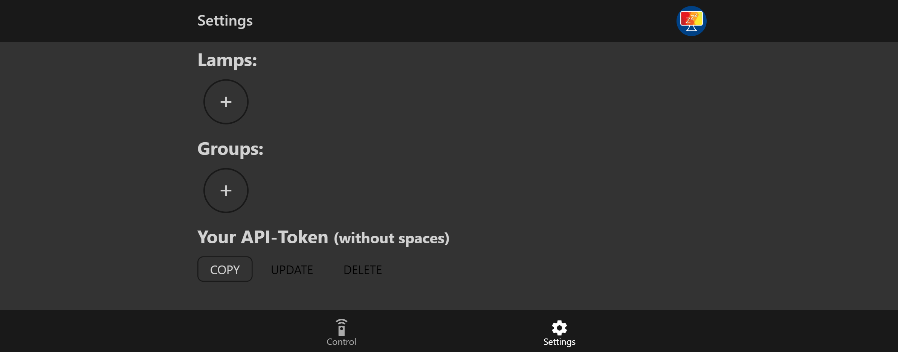
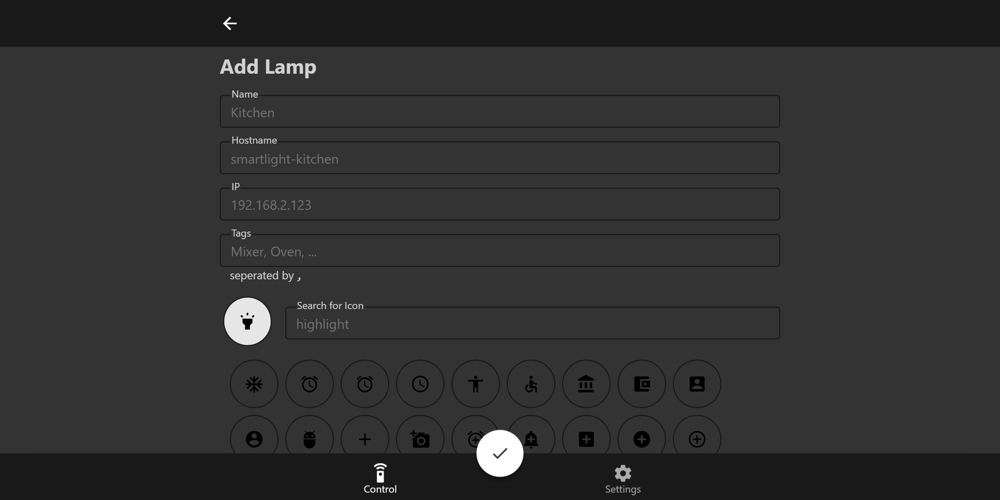

# Connect to your device

The Setup is almost done now 😊 The only thing todo is to open the webapp, login and add your lamp.

## [Step 0 - Open the Web-App](http://smartlight.hackedit.de/)

[http://smartlight.hackedit.de/](http://smartlight.hackedit.de/)

## Step 1 - Login

You can choose one of the given options. Whatever you choose, I promise you that I don't do anything with your data. I created this project purely for myself without any commercial interests. But be aware that for the same reason, this isn't a commercial product so it's totaly possible that I delete your userdata at some point or stop mainting the product at all. To be on the safe side, setup your own instance of the webapp. It's simple, I promise. 



## Step 2 - Add your Lamps

I think the UI is pretty self-explanatory but to be on the safe side:

### 1. Navigate to "Settings"

### 2. Click on the "+" below "Lamps:"

### 3. Fill in the information

Almost all fields are optional, except the Name, Hostname or IP, and the Icon. The Tags are only used to identify lamps when using the IFTTT Google Home adapter.

Add the Lamp by clicking the checkmark at the bottom of the page.

### 4. DONE - Control your lamps

