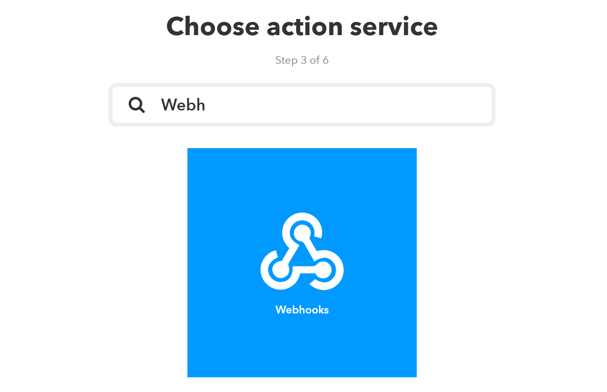

# Enable Google Assistant


You need an [IFTTT Account](https://ifttt.com/discover) to continue.


## Create a new IFTTT Applet

1. Open: [https://ifttt.com/create](https://ifttt.com/create)
2. Create Action Trigger
   1. Choose "Google Assistant" as the Service
   2. Choose "Say a phrase with a text ingredient"
   3. Enter some phrases with a $ placeholders like: "_Turn the light $_" \(figure 1\) and choose your language.
   4. Click "Create Trigger"
3. Create Action
   1. Choose "Webhooks" \(figure 2\) as your action service.
   2. Fill in the webhook form
      1. URL: [https://us-central1-smartlight-4861d.cloudfunctions.net/googleHomeApi/set](https://us-central1-smartlight-4861d.cloudfunctions.net/googleHomeApi/set)
      2. Method: POST
      3. Content Type: application/JSON
      4. Body
         1. Open the Web-App, go to settings and create your personal access token. \(figure 3\)
         2. Body Content:  { "uid": "YOUR USERID", "secret": "YOUR ACCESS TOKEN", "textString": "{{TextField}}" }
      5. Click "Create Action"
4. DONE - you can now say _"OKAY GOOGLE, turn on the kitchen light"_. Have fun discovering all the features.

